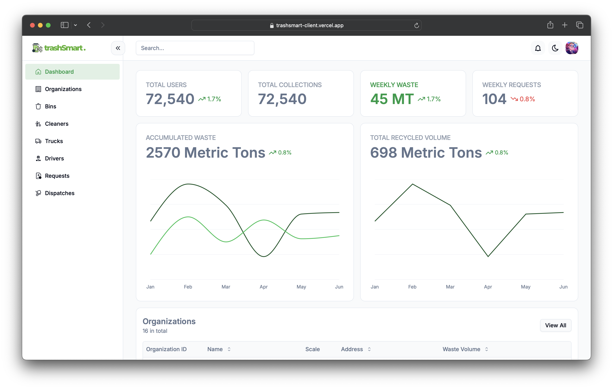
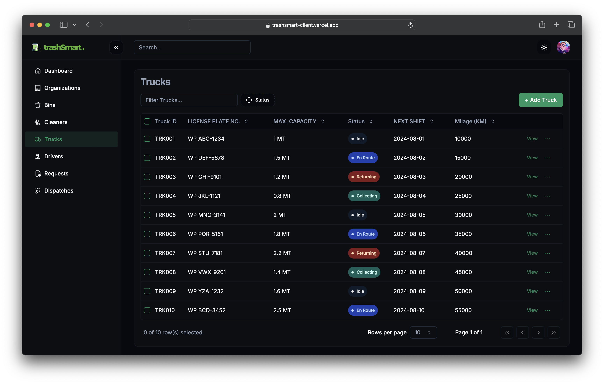
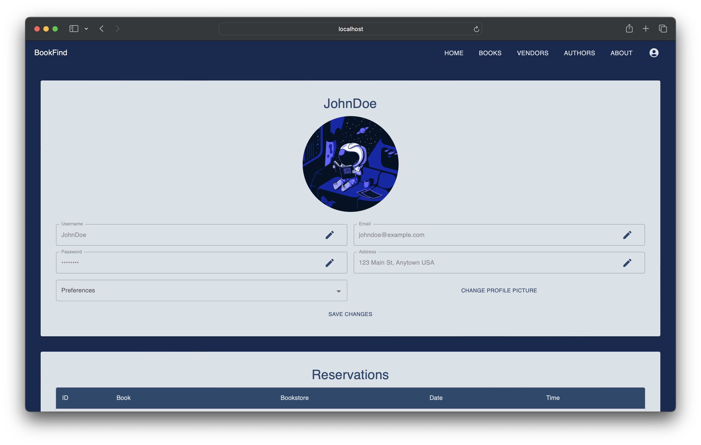

# My Projects

## Index

- [TrashSmart (Ongoing)](#trashsmart-ongoing)
- [TelChat](#telchat)
- [WoodCraft](#woodcraft)
- [BookFind](#bookfind)
- [Flower Exchange](#flower-exchange)
- [MyMalloc](#mymalloc)
- [IEEEDay2022](#ieeeday2022)
- [BMI Calculator](#bmi-calculator)
- [MADHack](#madhack)

### TrashSmart (Ongoing)

  

#### Description

TrashSmart is a comprehensive smart waste management system designed for Sri Lanka, addressing the challenges of inefficient waste collection and promoting sustainability. It comprises smart bins equipped with IoT sensors, a web application for contractors and organizations, and mobile applications for household users, truck drivers, and cleaning personnel.

#### Key Features

* **Real-Time Bin Monitoring:** Ultrasonic  sensors in smart bins collect and transmit data on fill levels and bin status, allowing for real-time monitoring by relevant stakeholders.
* **Optimized Collection Routes:** Utilizing Google Maps APIs and route optimization algorithms, TrashSmart dynamically creates efficient collection routes for garbage trucks, minimizing travel time and fuel consumption.
* **Automated Notifications & Alerts**: The system automatically notifies households about upcoming collection schedules and alerts relevant personnel about overflowing bins or other issues requiring attention.
* **User-Specific Dashboards & Insights:** Provides tailored dashboards and insightful reports to different user groups. Contractors can monitor fleet operations and bin status, while organizations gain insights into their waste generation and recycling rates.

#### Technologies

* **Frontend:** ***React.js*** for web application and **React Native** for mobile applications, ensuring responsive and user-friendly interfaces across devices. Deployed using ***Vercel*** for optimized web hosting.
* **Backend:** ***Java Spring Boot*** framework for robust backend services, handling data processing, routing logic, and communication with external services. Hosted on ***Koyeb*** for scalable and reliable backend infrastructure.
* **Database: *CockroachDB*** hosting a ***PostgreSQL*** database to store and manage user data, bin information, collection schedules, auction bids, and other system data securely and with high availability.
* **IoT Integration:** ***Arduino*** microcontrollers and sensors collect real-time data from smart bins and transmit it to the backend via WiFi.
* **Security & Authentication:** JWT (JSON Web Token) for role-based authentication and authorization, ensuring secure access to the system based on user roles and permissions.
* **Continuous Integration & Deployment:** ***GitHub Actions*** for automated build, projectsing, and deployment processes, streamlining development workflows and ensuring code quality.
* **Containerization:** ***Docker*** for containerizing the application and its dependencies, enabling consistent execution across different environments and simplifying deployment.

         

#### Screenshots

|  |  |  |
| --------------------------------- | --------------------------------- | --------------------------------- |
|  |  |  |

|  |  |  |  |
| --------------------------------- | --------------------------------- | ----------------------------------- | ----------------------------------- |

### TelChat

#### Description

An agent-based telecommunication assistant that optimizes task performance through natural language prompts, surpassing traditional chatbot efficiency on existing telecommunication platforms.

#### Key Features

The application consists of 3 main functionalities,

* Get general services-based details through our database using LLM.
* Calling tools to perform package activation, balance inquiry, request loans, etc.
* Connecting to a customer care human agent to get further support

#### Technologies

* **Frontend:** ***React.js*** for a dynamic and interactive user interface.
* **Agent:** ***FastAPI (Python)*** for building a high-performance agent that manages communication and task execution.
* **Backend:** ***Express.js*** for creating mock APIs during development, transitioning to a more robust solution in production.
* **AI Engine:** ***OpenAPI GPT model 3.5 turbo***, fine-tuned for telecommunication-specific tasks and language understanding.
* **Database:** ***MongoDB*** for flexible and scalable storage of user data and service information.

     

#### Screenshots

|  |  |
| --------------------------------------- | --------------------------------------- |
|  |  |

### WoodCraft

#### Description

An e-commerce platform integrated with a comprehensive production and inventory management system, transforming furniture business operations.

#### Key Features

* Online storefront: Showcase products, manage orders, process payments
* Order management: invoices,cancellations
* Real-time chat: Instant customer support and communication
* User management: Control access for different staff roles
* Production management: Track materials, manage manufacturing, worker and production tasks management
* Accurate stock levels
* Automated emails: Order updates, shipping
* Retail & Bulk orders: Flexible options, custom pricing for bulk
* Payment Integration: Secure payments via PayHere.
* Better UI/UX: User-friendly design for customers and staff.

#### Technologies

* **MVC Architecture:** for a efficient development and maintenance.
* **Frontend:** ***HTML/CSS, JavaScript*** for building responsive and interactive user interfaces.
* **Backend:** ***PHP*** for server-side scripting, handling requests, and managing business logic.
* **Database:** ***MySQL*** for structured storage and retrieval of application data.
* **WebSockets:** ***Ratchet*** for real-time, bidirectional communication between clients and the server.
* **Payments:** ***PayHere*** for secure and seamless payment processing.
* **Email Service:** ***PHPMailer*** for sending automated emails and managing notifications.

       

#### Screenshots

|    |    |    |
| ------------------------------------- | ------------------------------------- | ------------------------------------- |
|    |    |    |
|    |    |    |
|  |  |  |

### BookFind

#### Description

A web application to connect the bookstores, authors, and buyers to provide an efficient user experience for readers.

#### Technologies

* **Frontend:** ***React.js***
* **Backend:** ***Node.js*** and ***Express.js***
* **Database:** ***MongoDB***

   

#### Screenshots

|  |  |  |
| --------------------------------------- | --------------------------------------- | --------------------------------------- |

### Flower Exchange

#### Description

A project, completed in my first year as an undergraduate for a task given by the London Stock Exchange Group (LSEG), is a simple trading system that processes orders and provides execution reports.

### MyMalloc

* Custom memory allocation system in C.
* Simulates malloc and free functions.
* Manages a fixed-size memory array.
* Uses a linked list of memory blocks.
* Each block contains size and allocation status.
* Searches for suitable free blocks on memory request.
* Splits blocks if necessary and marks them as allocated.
* Releases memory and merges adjacent free blocks to reduce fragmentation.
* Demonstrates fundamental memory management techniques.

)

|  |  |
| :----------------------------------------------: | :----------------------------------------------: |

### IEEEDay2022

 

* As a part of the IEEE UCSC Student Branch Web Team, I contributed to the IEEE Day 2022 landing page.

### BMI Calculator

* A simple BMI calculator web application. this mimics the client-server architecture.

  

### MADHack

* I created this hackathon landing page for an IEEE Student Branch Web Team interview task.

   
